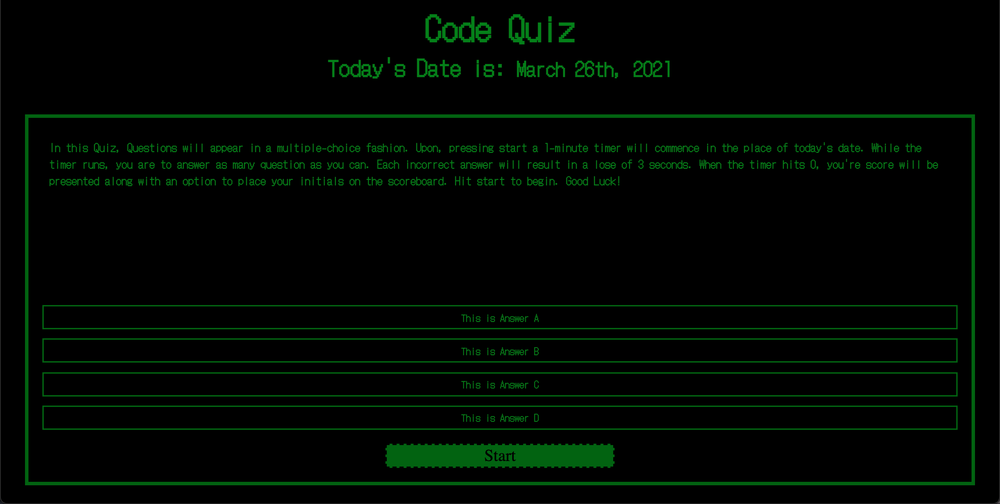

# Ant-s-Code-Quiz
-----Deployment----- 
Presented at the start up screen, is the date and an explanation of how to play the quiz. 
Upon clicking the Start Button: 
1.) The user will go through a series of questions 
2.) With 20 seconds on the clock each question will award points, while each incorrect answer will deduct 3 seconds on the clock  

Upon hitting the time limit or answering every question correctly, the user is presented a leaderboard with the option of submitting their initials or playing again. 
1.) Initials are restricted to 3 letters, not allowing the user to keydown non-alphabetical characters 
2.) Leaderboard is not in order, will only submit one initial per attempt. 
3.) Score is the time left when you answered correctly, added into a total.  

GITHUB URL: https://github.com/Anthony2428/Ant-s-Code-Quiz/  

# User Story
GIVEN I am taking a code quiz
WHEN I click the start button
THEN a timer starts and I am presented with a question
WHEN I answer a question
THEN I am presented with another question
WHEN I answer a question incorrectly
THEN time is subtracted from the clock
WHEN all questions are answered or the timer reaches 0
THEN the game is over
WHEN the game is over
THEN I can save my initials and my score

# 04 Web-APIs: Code Quiz